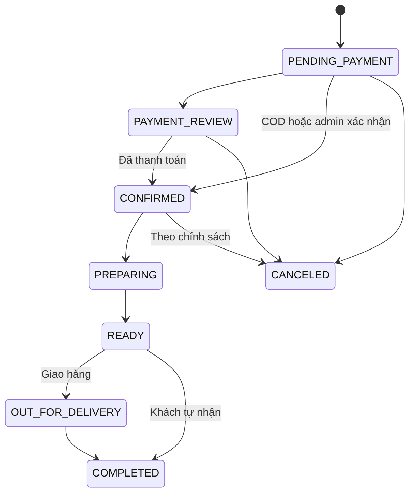
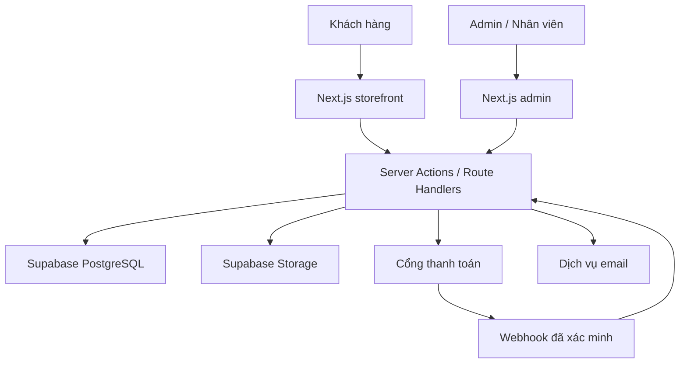

# KIẾN TRÚC TỔNG THỂ WEBSITE & HỆ THỐNG BÁN HÀNG MYNORA.COM

> Tài liệu bàn giao kỹ thuật cho ChatGPT 5.6 Terra  
> Thương hiệu: **MYNORA BAKERY**  
> Tên miền: **mynora.com**  
> Phiên bản tài liệu: **1.0 — 27/07/2026**  
> Thị trường khởi điểm: **Đà Nẵng, Việt Nam**  
> Mô hình: **Bánh làm theo đơn, nhận đặt trước, giao/nhận theo ngày và khung giờ**

---

## 1. Mục đích tài liệu

Tài liệu này là bản thiết kế tổng thể để ChatGPT 5.6 Terra có thể:

1. Hiểu đúng mô hình kinh doanh và phong cách thương hiệu MYNORA.
2. Khởi tạo đúng cấu trúc dự án ngay từ đầu.
3. Xây dựng website theo từng giai đoạn, mỗi giai đoạn đều có thể kiểm thử.
4. Tránh bỏ sót các phần quan trọng như quản lý đơn, ngày giao, thanh toán, bảo mật, SEO và vận hành.
5. Có tiêu chí nghiệm thu rõ ràng cho từng đầu mục công việc.

Tài liệu ưu tiên một hệ thống **đơn giản để vận hành trong giai đoạn đầu**, nhưng không khóa đường mở rộng khi MYNORA tăng số lượng sản phẩm, đơn hàng, nhân sự hoặc bổ sung khóa học/dịch vụ.

---

## 2. Bối cảnh và các giả định đã sử dụng

### 2.1. Thông tin đã xác định

- MYNORA là thương hiệu bánh online.
- Màu nhận diện chính là xanh navy.
- Có logo MYNORA BAKERY dạng monogram chữ M, vòng tròn và wordmark.
- Mô hình bán chủ yếu là đặt trước, làm theo đơn, gom đơn và giao vào ngày đã hẹn.
- Website cần hỗ trợ cả bán hàng và vận hành nội bộ.
- Danh sách sản phẩm khởi tạo có 8 sản phẩm.

### 2.2. Các giả định kỹ thuật

- Website sử dụng tiếng Việt và tiền tệ VND.
- Múi giờ hệ thống: `Asia/Ho_Chi_Minh`.
- Giai đoạn MVP tập trung phục vụ Đà Nẵng.
- Khách được đặt hàng không cần tạo tài khoản.
- Quản trị viên bắt buộc đăng nhập.
- Giá bán, lịch nhận đơn, phí giao hàng và trạng thái còn bán phải thay đổi được trong trang quản trị.
- Không quản lý nguyên liệu chi tiết ở MVP; chỉ quản lý khả năng nhận đơn và năng lực sản xuất.
- Hệ thống được thiết kế để có thể bổ sung thanh toán tự động, đơn vị vận chuyển và tài khoản khách hàng sau này.

### 2.3. Những dữ liệu chủ thương hiệu cần bổ sung trước khi mở bán

- Giá và quy cách của từng sản phẩm.
- Ảnh thật của từng sản phẩm.
- Thời gian chuẩn bị tối thiểu của từng sản phẩm.
- Số lượng tối đa có thể nhận mỗi ngày hoặc mỗi khung giờ.
- Khu vực giao hàng, phí giao và đơn tối thiểu.
- Thông tin tài khoản nhận thanh toán.
- Số điện thoại, Facebook, Instagram/TikTok, địa chỉ nhận bánh.
- Chính sách đổi/hủy đơn, bảo quản, giao hàng và xử lý khiếu nại.
- Thông tin pháp lý của chủ thể bán hàng và chủ thể ký hợp đồng với cổng thanh toán.

---

## 3. Mục tiêu sản phẩm

### 3.1. Mục tiêu kinh doanh

- Biến người xem thành người đặt bánh bằng một quy trình ngắn và dễ hiểu.
- Giảm việc chốt đơn thủ công qua tin nhắn.
- Hạn chế nhận quá nhiều đơn vượt khả năng sản xuất.
- Gom đầy đủ thông tin khách, sản phẩm, ngày giao và thanh toán vào một nơi.
- Giúp quản trị viên theo dõi đơn theo từng ngày sản xuất.
- Tạo nền tảng SEO cho thương hiệu MYNORA tại Đà Nẵng.

### 3.2. Mục tiêu trải nghiệm

- Khách hiểu ngay MYNORA bán gì và cách đặt bánh.
- Tìm sản phẩm, chọn quy cách và thêm vào giỏ dễ dàng trên điện thoại.
- Nhìn thấy ngày có thể nhận bánh trước khi thanh toán.
- Biết rõ tổng tiền hàng, phí giao và phương thức thanh toán.
- Nhận mã đơn và tra cứu trạng thái mà không cần đăng ký tài khoản.
- Giao diện thanh lịch, mềm mại, hiện đại và nhất quán với logo navy–ivory.

### 3.3. Chỉ số nên theo dõi

- Lượt xem trang sản phẩm.
- Tỷ lệ thêm vào giỏ.
- Tỷ lệ bắt đầu thanh toán.
- Tỷ lệ hoàn tất đơn.
- Giá trị đơn trung bình.
- Số đơn theo ngày giao.
- Tỷ lệ thanh toán thành công.
- Sản phẩm bán nhiều nhất.
- Nguồn truy cập tạo ra đơn hàng.

---

## 4. Phạm vi theo giai đoạn

### 4.1. Giai đoạn MVP — Bắt buộc để mở bán

- Website responsive cho điện thoại, tablet và desktop.
- Trang chủ, danh sách sản phẩm, chi tiết sản phẩm.
- Tìm kiếm/lọc cơ bản.
- Giỏ hàng.
- Checkout không cần tài khoản.
- Chọn nhận tại cửa hàng hoặc giao hàng.
- Chọn ngày và khung giờ còn khả dụng.
- Áp dụng phí giao theo khu vực.
- Thanh toán chuyển khoản thủ công và/hoặc COD theo cấu hình.
- Trang hoàn tất và tra cứu đơn bằng mã đơn + số điện thoại hoặc public token bảo mật.
- Trang quản trị sản phẩm, đơn hàng, lịch nhận đơn và cài đặt.
- Email thông báo cơ bản; nếu chưa có email provider thì phải có cơ chế thay thế bằng thông báo trong admin.
- SEO kỹ thuật, sitemap, robots, metadata, Product structured data.
- Nhật ký thay đổi trạng thái đơn.
- Kiểm thử tự động các luồng quan trọng.
- Triển khai production tại `mynora.com`.

### 4.2. Giai đoạn 1.1 — Tối ưu vận hành

- Dashboard sản xuất theo ngày.
- Phiếu sản xuất/tổng hợp số lượng bánh.
- Mã giảm giá.
- Thanh toán tự động qua payOS.
- Webhook thanh toán có xác minh chữ ký và chống xử lý trùng.
- Xuất danh sách đơn CSV.
- Tin nhắn/email tự động theo trạng thái.
- Ghi chú nội bộ cho từng đơn.
- Quản lý banner và nội dung trang chủ.
- Báo cáo doanh thu cơ bản.

### 4.3. Giai đoạn 2 — Mở rộng

- Tài khoản và lịch sử mua của khách.
- Điểm thưởng/hạng thành viên.
- Đánh giá sản phẩm có kiểm duyệt.
- Tích hợp đơn vị vận chuyển.
- Quản lý lô sản xuất nâng cao.
- Bán khóa học, voucher hoặc dịch vụ.
- Đa chi nhánh.
- PWA hoặc ứng dụng quản trị di động nếu thực sự cần.

### 4.4. Ngoài phạm vi MVP

- Hệ thống ERP/kế toán hoàn chỉnh.
- Quản lý tồn kho nguyên liệu theo định mức.
- Marketplace nhiều người bán.
- Ứng dụng mobile native.
- Chat realtime tự xây dựng.
- Hệ thống khóa học LMS đầy đủ.

Không đưa các phần ngoài phạm vi vào MVP nếu chúng làm chậm việc mở bán.

---

## 5. Danh mục sản phẩm khởi tạo

Tên trong dữ liệu cần có `display_name`, `slug`, `short_description`, `description`, `category`, `base_price`, `lead_time_hours`, `storage_instructions` và `allergen_note`.

| STT | Tên hiển thị đề xuất | Slug đề xuất | Ghi chú chuẩn hóa |
|---:|---|---|---|
| 1 | Coconut Flan | `coconut-flan` | Giữ tên thương mại hiện tại |
| 2 | Gâteau Coconut Flan | `gateau-coconut-flan` | Chuẩn hóa “Gato” thành “Gâteau” |
| 3 | Su kem | `su-kem` | Có thể bổ sung tên phụ “Choux Cream” |
| 4 | Brownies | `brownies` | Xác nhận bán theo miếng, hộp hoặc size |
| 5 | Basque Burnt Cheesecake | `basque-burnt-cheesecake` | Sửa “Basque burn Chessecake” |
| 6 | Crêpe | `crepe` | Sửa “Crep”; xác nhận dạng bánh cụ thể |
| 7 | Cookie hạnh nhân chocolate chip | `cookie-hanh-nhan-chocolate-chip` | Xác nhận số chiếc/hộp |
| 8 | Tiramisu | `tiramisu` | Xác nhận size và dạng hộp |

Mỗi sản phẩm phải cho phép có nhiều `variant`, ví dụ:

- Size S/M/L.
- Hộp 4/6/8 chiếc.
- Nguyên bánh hoặc theo phần.
- Giá khác nhau theo quy cách.

Không hard-code giá, size, tình trạng bán hoặc thời gian chuẩn bị trong component giao diện.

---

## 6. Người dùng và phân quyền

### 6.1. Khách vãng lai

- Xem sản phẩm và nội dung.
- Thêm sản phẩm vào giỏ.
- Đặt hàng không cần tài khoản.
- Tra cứu đơn bằng thông tin bảo mật.
- Gửi liên hệ.

### 6.2. Khách có tài khoản — Giai đoạn 2

- Quản lý hồ sơ và địa chỉ.
- Xem lịch sử đơn.
- Đặt lại đơn cũ.
- Theo dõi ưu đãi/điểm thưởng.

### 6.3. Nhân viên

- Xem đơn được phép.
- Cập nhật trạng thái chuẩn bị/giao hàng.
- Xem dashboard sản xuất.
- Không được chỉnh quyền hoặc cấu hình bảo mật.

### 6.4. Quản trị viên

- Toàn quyền sản phẩm, đơn hàng, lịch nhận đơn, nội dung, phí giao, khuyến mãi và báo cáo.
- Xem nhật ký thao tác.
- Quản lý tài khoản nhân viên nếu giai đoạn đó có nhiều nhân sự.

Áp dụng quyền theo vai trò ở cả giao diện lẫn phía server; ẩn nút trên giao diện không được xem là một biện pháp bảo mật.

---

## 7. Sơ đồ trang

### 7.1. Khu vực khách hàng

| Route | Trang | Mục tiêu |
|---|---|---|
| `/` | Trang chủ | Giới thiệu thương hiệu, sản phẩm nổi bật, cách đặt bánh |
| `/san-pham` | Danh sách sản phẩm | Duyệt, lọc và tìm sản phẩm |
| `/san-pham/[slug]` | Chi tiết sản phẩm | Ảnh, mô tả, quy cách, giá, ngày nhận gần nhất |
| `/gio-hang` | Giỏ hàng | Kiểm tra sản phẩm và số lượng |
| `/thanh-toan` | Thanh toán | Thông tin khách, giao/nhận, lịch, thanh toán |
| `/dat-hang-thanh-cong/[token]` | Xác nhận đơn | Mã đơn và hướng dẫn tiếp theo |
| `/tra-cuu-don-hang` | Tra cứu đơn | Nhập mã đơn và số điện thoại |
| `/don-hang/[token]` | Chi tiết đơn công khai | Xem trạng thái bằng token không thể đoán |
| `/cau-chuyen-mynora` | Câu chuyện thương hiệu | Tăng tin cậy và cảm xúc thương hiệu |
| `/huong-dan-dat-banh` | Hướng dẫn đặt bánh | Giải thích thời gian đặt trước, giao/nhận |
| `/bao-quan-banh` | Hướng dẫn bảo quản | Nội dung theo từng nhóm bánh |
| `/chinh-sach` | Chính sách | Đặt cọc, hủy/đổi, giao hàng, quyền riêng tư |
| `/lien-he` | Liên hệ | Điện thoại, mạng xã hội, địa chỉ |

### 7.2. Khu vực quản trị

| Route | Chức năng |
|---|---|
| `/admin/login` | Đăng nhập |
| `/admin` | Tổng quan hôm nay |
| `/admin/orders` | Danh sách và lọc đơn |
| `/admin/orders/[id]` | Chi tiết, thanh toán, lịch sử trạng thái |
| `/admin/production` | Tổng hợp sản xuất theo ngày |
| `/admin/products` | Quản lý sản phẩm |
| `/admin/products/[id]` | Sửa sản phẩm, biến thể, ảnh |
| `/admin/categories` | Quản lý danh mục |
| `/admin/delivery` | Khu vực, phí và khung giờ giao/nhận |
| `/admin/calendar` | Ngày mở/đóng nhận đơn và năng lực |
| `/admin/promotions` | Mã giảm giá — giai đoạn 1.1 |
| `/admin/content` | Banner, nội dung trang chủ, chính sách |
| `/admin/reports` | Báo cáo cơ bản — giai đoạn 1.1 |
| `/admin/settings` | Thông tin cửa hàng và cấu hình |

---

## 8. Luồng nghiệp vụ chính

### 8.1. Luồng đặt bánh

1. Khách mở trang sản phẩm.
2. Chọn biến thể/quy cách và số lượng.
3. Hệ thống hiển thị giá và thời gian chuẩn bị sớm nhất.
4. Khách thêm sản phẩm vào giỏ.
5. Tại checkout, khách chọn giao hàng hoặc tự nhận.
6. Hệ thống tính ngày sớm nhất dựa trên sản phẩm có `lead_time_hours` dài nhất.
7. Hệ thống chỉ hiển thị ngày và khung giờ còn mở, chưa hết năng lực.
8. Khách nhập tên, số điện thoại, địa chỉ và ghi chú.
9. Server đọc lại sản phẩm từ database, tự tính giá và phí giao; không tin dữ liệu giá từ trình duyệt.
10. Hệ thống tạo đơn và giữ chỗ năng lực trong thời gian cấu hình.
11. Khách chọn COD/chuyển khoản/payOS tùy phương thức đang bật.
12. Hệ thống trả mã đơn và hướng dẫn tiếp theo.
13. Quản trị viên xác nhận thanh toán và đơn.
14. Đơn đi qua các bước chuẩn bị, sẵn sàng, giao hàng, hoàn tất.

### 8.2. Luồng quản trị đơn

1. Admin nhận đơn mới.
2. Kiểm tra phương thức giao, ngày nhận và ghi chú.
3. Xác nhận/đối soát thanh toán.
4. Chuyển đơn sang `CONFIRMED`.
5. Dashboard sản xuất gom số lượng theo sản phẩm/biến thể/ngày.
6. Nhân viên cập nhật `PREPARING`.
7. Khi hoàn thành, chuyển `READY`.
8. Nếu giao hàng, chuyển `OUT_FOR_DELIVERY`.
9. Kết thúc ở `COMPLETED`; mọi thay đổi được ghi lịch sử.

### 8.3. Trạng thái đơn



Không cho phép nhảy trạng thái tùy ý. Mỗi chuyển trạng thái phải đi qua một hàm nghiệp vụ có kiểm tra quyền và quy tắc.

### 8.4. Trạng thái thanh toán

- `UNPAID`
- `PENDING`
- `PAID`
- `FAILED`
- `REFUND_PENDING`
- `REFUNDED`

Trạng thái đơn hàng và trạng thái thanh toán phải là hai trường riêng biệt.

---

## 9. Quy tắc nghiệp vụ quan trọng

### 9.1. Giá

- Lưu tiền bằng số nguyên VND, ví dụ `125000`; không dùng số thực.
- Server là nguồn xác định giá cuối cùng.
- `order_items` phải lưu snapshot tên, biến thể và đơn giá tại thời điểm đặt.
- Thay giá sản phẩm sau này không được làm thay đổi đơn cũ.

### 9.2. Ngày giao/nhận

- Tính ngày sớm nhất theo thời gian chuẩn bị dài nhất trong giỏ.
- Có giờ chốt đơn mỗi ngày, ví dụ sau 18:00 thì ngày sớm nhất tăng thêm một ngày.
- Admin được khóa ngày nghỉ hoặc ngày kín đơn.
- Mỗi khung giờ có `capacity`.
- Khi đơn chưa thanh toán quá thời gian giữ chỗ, hệ thống được giải phóng capacity.
- Mọi phép tính phải theo `Asia/Ho_Chi_Minh`.

### 9.3. Năng lực sản xuất

MVP có thể dùng một trong hai cơ chế, ưu tiên cơ chế A:

- **A — Capacity point:** mỗi biến thể có số điểm sản xuất, mỗi ngày/slot có tổng điểm tối đa.
- **B — Số đơn tối đa:** giới hạn tổng số đơn cho từng slot.

Ví dụ: cheesecake có thể tốn nhiều điểm hơn cookie. Không hard-code các con số; admin phải cấu hình được.

### 9.4. Giỏ hàng

- Giỏ được lưu cục bộ trên trình duyệt ở MVP.
- Khi checkout, server phải kiểm tra lại sản phẩm còn bán, giá, số lượng tối đa, ngày khả dụng và capacity.
- Nếu có thay đổi, báo rõ item nào thay đổi và yêu cầu khách xác nhận.

### 9.5. Hủy đơn

- Quy tắc hủy phụ thuộc trạng thái, ngày giao và chính sách MYNORA.
- Đơn đã `PREPARING` không được hủy tự động từ phía khách.
- Admin phải nhập lý do khi hủy.
- Không xóa vĩnh viễn đơn hàng đã phát sinh; dùng trạng thái và audit log.

### 9.6. Tra cứu đơn

- Không để lộ đơn chỉ bằng UUID hoặc số thứ tự đoán được.
- Phương án 1: mã đơn + số điện thoại.
- Phương án 2: public token ngẫu nhiên đủ dài.
- Che bớt thông tin cá nhân ở trang tra cứu công khai.

---

## 10. Yêu cầu chức năng chi tiết

### 10.1. Trang chủ

- Header có logo, menu, nút giỏ hàng.
- Hero có thông điệp ngắn và CTA “Đặt bánh”.
- Sản phẩm nổi bật.
- Quy trình đặt bánh 3 bước.
- Điểm khác biệt của MYNORA.
- Hình ảnh thật.
- Nội dung thời gian đặt trước.
- Liên kết mạng xã hội.
- Footer đủ thông tin liên hệ và chính sách.
- Nội dung chính có thể chỉnh trong admin hoặc file cấu hình ở MVP.

### 10.2. Danh sách sản phẩm

- Grid responsive.
- Ảnh đúng tỷ lệ, không méo.
- Tên, giá từ, trạng thái và lead time ngắn.
- Lọc theo danh mục.
- Tìm theo tên.
- Sắp xếp cơ bản.
- Empty state rõ ràng.
- Skeleton loading khi cần.

### 10.3. Chi tiết sản phẩm

- Gallery ảnh.
- Tên, mô tả ngắn, giá.
- Chọn biến thể.
- Số lượng.
- Ngày nhận sớm nhất.
- Thành phần/mô tả.
- Dị ứng và bảo quản.
- CTA thêm giỏ.
- Sản phẩm liên quan.
- Product JSON-LD phản ánh đúng nội dung hiển thị.

### 10.4. Giỏ hàng

- Sửa số lượng và xóa item.
- Tạm tính.
- Cảnh báo thời gian chuẩn bị.
- Nút sang checkout.
- Trạng thái giỏ trống.
- Không hiển thị phí giao chính xác trước khi khách chọn khu vực.

### 10.5. Checkout

- Thông tin: họ tên, điện thoại, email tùy chọn.
- Phương thức nhận: giao hàng/tự nhận.
- Địa chỉ và khu vực giao nếu giao hàng.
- Ngày và khung giờ.
- Ghi chú.
- Phương thức thanh toán.
- Checkbox đồng ý chính sách.
- Tóm tắt đơn.
- Tổng tiền gồm tiền hàng, giảm giá, phí giao và tổng cuối.
- Chống submit hai lần.
- Thông báo lỗi theo từng trường, bằng tiếng Việt.
- Hỗ trợ bàn phím và trình đọc màn hình.

### 10.6. Trang xác nhận/tra cứu

- Mã đơn.
- Trạng thái đơn và thanh toán.
- Sản phẩm, số lượng, tổng tiền.
- Ngày/khung giờ và phương thức nhận.
- Hướng dẫn thanh toán nếu còn thiếu.
- Kênh liên hệ.
- Không hiển thị dữ liệu nhạy cảm quá mức.

### 10.7. Quản trị sản phẩm

- Tạo/sửa/ẩn sản phẩm.
- Quản lý biến thể, giá, SKU nội bộ.
- Sắp xếp ảnh.
- Gắn sản phẩm nổi bật.
- Lead time, capacity point, min/max quantity.
- SEO title/description tùy chọn.
- Preview trước khi xuất bản.

### 10.8. Quản trị đơn

- Tìm theo mã, tên, điện thoại.
- Lọc theo ngày giao, trạng thái đơn, trạng thái thanh toán và phương thức nhận.
- Xem chi tiết đầy đủ.
- Chuyển trạng thái theo quy tắc.
- Thêm ghi chú nội bộ.
- Ghi nhận thanh toán thủ công.
- In hoặc xuất phiếu đơn nếu cần.
- Audit log cho hành động quan trọng.

### 10.9. Dashboard sản xuất

- Chọn ngày.
- Tổng hợp số lượng theo sản phẩm và biến thể.
- Danh sách đơn trong ngày.
- Phân biệt tự nhận và giao hàng.
- Đánh dấu đang làm/đã xong.
- Không tính đơn đã hủy.
- Mặc định chỉ tính đơn `CONFIRMED` trở đi.

### 10.10. Cài đặt

- Tên cửa hàng và thông tin liên hệ.
- Địa chỉ nhận hàng.
- Giờ hoạt động.
- Giờ chốt đơn.
- Thời gian giữ đơn chưa thanh toán.
- Phương thức thanh toán đang bật.
- Khu vực và phí giao.
- Ngày nghỉ/đóng nhận đơn.
- Liên kết mạng xã hội.

---

## 11. Thiết kế nhận diện

### 11.1. Màu trích từ logo

| Token | Màu | Mục đích |
|---|---|---|
| `--brand-navy-900` | `#052B53` | Màu chính, chữ, header, CTA |
| `--brand-navy-700` | `#2C4E6D` | Hover, nội dung phụ |
| `--brand-navy-500` | `#5C748A` | Border, icon phụ |
| `--brand-ivory-100` | `#F8EBE2` | Nền thương hiệu |
| `--surface-white` | `#FFFFFF` | Card và vùng nội dung |
| `--text-primary` | `#17202A` | Body text |
| `--success` | `#2F6B4F` | Thành công |
| `--warning` | `#9A6518` | Chờ xử lý |
| `--danger` | `#A53A3A` | Lỗi/hủy |

Các mã navy và ivory là giá trị gần đúng được lấy từ file logo; cần kiểm tra lại với file thiết kế gốc nếu có bộ nhận diện chính thức.

### 11.2. Typography đề xuất

- Heading/branding: `Cormorant Garamond` hoặc serif tương đương có hỗ trợ tiếng Việt.
- Body/UI: `Be Vietnam Pro` hoặc sans-serif tương đương.
- Dùng `next/font` để tối ưu tải font.
- Không dùng quá hai họ font.
- Cỡ chữ body tối thiểu 16px ở giao diện khách hàng.

### 11.3. Nguyên tắc giao diện

- Sang, nhẹ, nhiều khoảng thở.
- Không lạm dụng khung, gradient và hiệu ứng.
- Navy là màu nhấn; ivory là nền ấm.
- Ảnh bánh thật là trọng tâm.
- Border radius vừa phải; tránh quá tròn làm mất vẻ trưởng thành.
- Animation ngắn, tinh tế và phải tôn trọng `prefers-reduced-motion`.
- Không đặt chữ dài trực tiếp lên vùng ảnh khó đọc.

### 11.4. Xử lý logo

- Giữ file logo gốc không chỉnh sửa.
- Tạo các bản xuất phục vụ website:
  - Logo đầy đủ nền ivory.
  - Logo nền trong suốt.
  - Monogram vuông.
  - Favicon 32×32 và 48×48.
  - Apple touch icon 180×180.
  - Open Graph image 1200×630.
- Header không dùng nguyên ảnh vuông có khoảng trắng lớn; dùng bản logo đã crop đúng và tối ưu.
- Ảnh đầu vào lưu ở `/public/brand/`, đặt tên rõ ràng và có alt text phù hợp.

### 11.5. Component UI tối thiểu

- Button, IconButton.
- Input, Textarea, Select, Checkbox, Radio.
- FormField và ErrorMessage.
- Card, Badge, Alert, Dialog, Drawer.
- ProductCard, ProductGallery, Price.
- QuantitySelector.
- CartDrawer.
- DatePicker và DeliverySlotPicker.
- OrderStatusBadge và OrderTimeline.
- DataTable cho admin.
- EmptyState, LoadingState, ErrorState.
- Toast chỉ dùng cho phản hồi ngắn; lỗi quan trọng phải hiển thị trong nội dung.

---

## 12. Kiến trúc kỹ thuật đề xuất

### 12.1. Công nghệ

| Lớp | Công nghệ đề xuất |
|---|---|
| Web framework | Next.js App Router + TypeScript |
| Styling | Tailwind CSS + component primitives có accessibility |
| Validation | Zod |
| Forms | React Hook Form hoặc Server Actions phù hợp từng form |
| Database | Supabase PostgreSQL |
| Authentication | Supabase Auth cho admin/nhân viên |
| File storage | Supabase Storage cho ảnh sản phẩm |
| Hosting | Vercel |
| Email | Resend/Postmark hoặc provider tương đương |
| Payment | Chuyển khoản/COD trước; payOS ở giai đoạn 1.1 |
| Analytics | GA4 hoặc giải pháp analytics được chủ thương hiệu duyệt |
| Monitoring | Vercel logs + error tracking như Sentry khi production |
| Testing | Vitest + React Testing Library + Playwright |

Không khóa phiên bản thư viện trong tài liệu. Terra phải dùng phiên bản ổn định tương thích tại thời điểm triển khai, commit lockfile và không tự ý nâng major version giữa dự án.

### 12.2. Lý do lựa chọn

- Next.js App Router hỗ trợ routing theo file, Server Components và các khả năng full-stack phù hợp cho storefront.
- Supabase gom PostgreSQL, Auth và Storage vào một nền tảng; vẫn giữ database PostgreSQL chuẩn.
- Vercel phù hợp với quy trình preview deployment và triển khai Next.js.
- Cấu trúc này đủ nhẹ cho MYNORA giai đoạn đầu nhưng vẫn mở rộng được.

### 12.3. Sơ đồ hệ thống



### 12.4. Nguyên tắc kiến trúc

- Ưu tiên Server Components; chỉ thêm Client Component khi cần tương tác trình duyệt.
- Tách UI, nghiệp vụ và truy cập dữ liệu.
- Không gọi database rải rác trực tiếp trong component.
- Mỗi nghiệp vụ quan trọng có service/use-case rõ ràng.
- Mọi input từ client phải được validate ở server.
- Không để secret trong biến môi trường public.
- Tất cả migration database phải nằm trong repository.
- Có seed data phát triển và seed sản phẩm khởi tạo.

---

## 13. Cấu trúc repository đề xuất

```text
mynora/
├── app/
│   ├── (storefront)/
│   │   ├── page.tsx
│   │   ├── san-pham/
│   │   ├── gio-hang/
│   │   ├── thanh-toan/
│   │   ├── tra-cuu-don-hang/
│   │   └── don-hang/
│   ├── admin/
│   │   ├── login/
│   │   ├── orders/
│   │   ├── products/
│   │   ├── production/
│   │   └── settings/
│   ├── api/
│   │   ├── checkout/
│   │   ├── payments/
│   │   └── webhooks/
│   ├── layout.tsx
│   ├── robots.ts
│   └── sitemap.ts
├── components/
│   ├── ui/
│   ├── storefront/
│   ├── checkout/
│   └── admin/
├── features/
│   ├── catalog/
│   ├── cart/
│   ├── checkout/
│   ├── orders/
│   ├── payments/
│   ├── delivery/
│   └── production/
├── lib/
│   ├── auth/
│   ├── db/
│   ├── env/
│   ├── money/
│   ├── validation/
│   └── observability/
├── public/
│   └── brand/
├── supabase/
│   ├── migrations/
│   ├── seed.sql
│   └── config.toml
├── tests/
│   ├── unit/
│   ├── integration/
│   └── e2e/
├── docs/
│   ├── architecture.md
│   ├── business-rules.md
│   └── runbook.md
├── .env.example
├── middleware.ts
├── package.json
└── README.md
```

Nếu phiên bản Next.js hiện hành dùng quy ước file khác, Terra được phép điều chỉnh nhưng phải giữ nguyên ranh giới module và ghi lại lý do trong `docs/architecture.md`.

---

## 14. Mô hình dữ liệu

### 14.1. Quy ước

- Primary key: UUID.
- Timestamp: `timestamptz`.
- Giá: `integer` hoặc `bigint` theo VND.
- Slug là duy nhất.
- Dữ liệu nghiệp vụ quan trọng không xóa cứng.
- Có `created_at`, `updated_at`; thêm `deleted_at` khi cần soft delete.
- Enum database hoặc check constraint cho trạng thái quan trọng.

### 14.2. Bảng chính

#### `profiles`

- `id` — FK đến auth user.
- `full_name`.
- `role`: `ADMIN`, `STAFF`.
- `is_active`.
- `created_at`, `updated_at`.

#### `categories`

- `id`.
- `name`.
- `slug`.
- `description`.
- `sort_order`.
- `is_active`.

#### `products`

- `id`.
- `category_id`.
- `name`.
- `slug`.
- `short_description`.
- `description`.
- `ingredients_text`.
- `allergen_note`.
- `storage_instructions`.
- `lead_time_hours`.
- `capacity_points`.
- `is_active`.
- `is_featured`.
- `seo_title`, `seo_description`.
- `created_at`, `updated_at`.

#### `product_variants`

- `id`.
- `product_id`.
- `name`.
- `sku`.
- `price_vnd`.
- `compare_at_price_vnd` — nullable.
- `min_quantity`.
- `max_quantity`.
- `sort_order`.
- `is_active`.

#### `product_images`

- `id`.
- `product_id`.
- `storage_path`.
- `alt_text`.
- `width`, `height`.
- `sort_order`.
- `is_primary`.

#### `delivery_zones`

- `id`.
- `name`.
- `districts_or_rules` — JSONB nếu cần.
- `fee_vnd`.
- `minimum_order_vnd`.
- `is_active`.

#### `delivery_slots`

- `id`.
- `date`.
- `start_time`, `end_time`.
- `fulfillment_type`: `DELIVERY`, `PICKUP`, `BOTH`.
- `capacity_total`.
- `capacity_reserved`.
- `is_open`.
- Unique constraint phù hợp cho ngày + giờ + loại.

#### `blackout_dates`

- `id`.
- `date`.
- `reason`.
- `fulfillment_type`.

#### `orders`

- `id`.
- `order_number` — duy nhất, dạng thân thiện.
- `public_token_hash` hoặc token đã được xử lý an toàn.
- `customer_name`.
- `customer_phone`.
- `customer_email` — nullable.
- `fulfillment_type`.
- `delivery_zone_id` — nullable.
- `delivery_address` — nullable.
- `delivery_date`.
- `delivery_slot_id`.
- `customer_note`.
- `internal_note`.
- `order_status`.
- `payment_status`.
- `payment_method`.
- `subtotal_vnd`.
- `discount_vnd`.
- `delivery_fee_vnd`.
- `total_vnd`.
- `expires_at` — cho đơn chờ thanh toán.
- `created_at`, `updated_at`, `canceled_at`.

#### `order_items`

- `id`.
- `order_id`.
- `product_id` — nullable nếu sản phẩm sau này bị archive.
- `variant_id` — nullable.
- `product_name_snapshot`.
- `variant_name_snapshot`.
- `sku_snapshot`.
- `unit_price_vnd`.
- `quantity`.
- `line_total_vnd`.
- `capacity_points_snapshot`.

#### `payments`

- `id`.
- `order_id`.
- `provider`.
- `provider_reference`.
- `amount_vnd`.
- `status`.
- `paid_at`.
- `raw_metadata` — JSONB, hạn chế dữ liệu nhạy cảm.
- `created_at`, `updated_at`.

#### `order_status_history`

- `id`.
- `order_id`.
- `from_status`.
- `to_status`.
- `reason`.
- `changed_by`.
- `created_at`.

#### `webhook_events`

- `id`.
- `provider`.
- `external_event_id`.
- `signature_valid`.
- `processing_status`.
- `payload_hash`.
- `processed_at`.
- Unique theo provider + external event id để chống xử lý trùng.

#### `coupons` — Giai đoạn 1.1

- `id`.
- `code`.
- `discount_type`.
- `discount_value`.
- `minimum_order_vnd`.
- `starts_at`, `ends_at`.
- `usage_limit`, `used_count`.
- `is_active`.

#### `site_settings`

- `key`.
- `value` — JSONB.
- `updated_by`.
- `updated_at`.

#### `audit_logs`

- `id`.
- `actor_id`.
- `action`.
- `entity_type`.
- `entity_id`.
- `before_data`, `after_data` — đã loại dữ liệu bí mật.
- `created_at`.

### 14.3. Ràng buộc dữ liệu

- `price_vnd >= 0`.
- `quantity > 0`.
- `line_total_vnd = unit_price_vnd * quantity`.
- `total_vnd = subtotal_vnd - discount_vnd + delivery_fee_vnd`.
- `delivery_address` bắt buộc khi `fulfillment_type = DELIVERY`.
- `delivery_zone_id` bắt buộc khi giao hàng.
- Không đặt vào slot đã đóng hoặc vượt capacity.
- Một mã đơn chỉ thuộc một đơn.
- Webhook xử lý idempotent.

---

## 15. API, Server Actions và services

Tên endpoint có thể thay đổi, nhưng trách nhiệm phải giữ rõ.

### 15.1. Public

- `GET /api/products` — nếu cần client fetch; ưu tiên server-render trực tiếp.
- `GET /api/products/[slug]`.
- `POST /api/availability` — kiểm tra ngày/slot theo cart.
- `POST /api/checkout/quote` — server tính lại toàn bộ giá.
- `POST /api/checkout/create-order`.
- `POST /api/orders/lookup`.
- `GET /api/orders/public/[token]`.

### 15.2. Payment

- `POST /api/payments/payos/create`.
- `POST /api/webhooks/payos`.
- `GET /api/payments/payos/return` chỉ phục vụ UX.

Webhook đã xác minh mới là nguồn tin cậy để ghi nhận thanh toán; không đánh dấu `PAID` chỉ từ query parameter của return URL.

### 15.3. Admin

- CRUD sản phẩm, variant, category.
- Cập nhật đơn bằng command rõ ràng, không dùng một endpoint update tùy ý.
- Quản lý slot, blackout date, delivery zone.
- Upload ảnh qua signed upload hoặc server-controlled path.

### 15.4. Service/use-case bắt buộc

- `calculateCartQuote`.
- `getAvailableDeliverySlots`.
- `reserveCapacity`.
- `releaseExpiredReservation`.
- `createOrder`.
- `transitionOrderStatus`.
- `recordManualPayment`.
- `handlePaymentWebhook`.
- `buildProductionSummary`.

Mỗi service phải có unit test cho trường hợp thành công, dữ liệu sai và cạnh tranh capacity.

---

## 16. Thanh toán

### 16.1. Giai đoạn MVP

- Chuyển khoản ngân hàng thủ công.
- COD chỉ bật nếu MYNORA chấp nhận.
- Tạo nội dung chuyển khoản chứa mã đơn.
- Admin có nút xác nhận đã thanh toán.
- Không yêu cầu khách tải ảnh chuyển khoản nếu chưa thật sự cần.

### 16.2. payOS — Giai đoạn 1.1

- Tạo payment link ở server.
- Secret chỉ nằm ở server.
- Xác minh signature webhook.
- Lưu event id để chống xử lý trùng.
- Kiểm tra số tiền, mã đơn và trạng thái trước khi cập nhật.
- Return URL chỉ hiển thị kết quả tạm thời rồi đọc trạng thái thật từ server.
- Có cơ chế retry và log khi webhook lỗi.
- Dùng môi trường test và đơn giá trị nhỏ để kiểm tra end-to-end trước production.
- Tài khoản thanh toán phải thuộc chủ thể đủ điều kiện pháp lý và hoàn tất xác minh theo yêu cầu của nhà cung cấp.

Thiết kế payment qua interface `PaymentProvider` để có thể thay provider mà không sửa toàn bộ checkout.

---

## 17. Bảo mật và quyền riêng tư

### 17.1. Bắt buộc

- Không đưa Supabase service-role key ra client.
- Bật Row Level Security cho mọi bảng được truy cập qua API Supabase.
- Public chỉ được đọc sản phẩm/danh mục đang active.
- Admin/Staff truy cập theo role.
- Validate input server-side bằng schema.
- Recalculate giá server-side.
- Rate limit đăng nhập, checkout, lookup đơn và contact form.
- Chống submit hai lần bằng idempotency key.
- Xác minh webhook signature và chống replay.
- Dùng secure headers: CSP, HSTS ở production, `X-Content-Type-Options`, `Referrer-Policy`.
- Cookie auth dùng `HttpOnly`, `Secure`, `SameSite` phù hợp.
- Không log secret, token, nội dung thanh toán đầy đủ hoặc PII không cần thiết.
- Backup database và kiểm tra khả năng phục hồi.
- Bật MFA cho tài khoản admin nếu provider hỗ trợ.

### 17.2. Quyền riêng tư

- Chỉ thu thập dữ liệu cần thiết để xử lý đơn.
- Có trang chính sách quyền riêng tư.
- Quy định thời gian giữ dữ liệu liên hệ và đơn hàng.
- Cho phép admin xuất/xóa dữ liệu theo quy định áp dụng, nhưng không phá dữ liệu kế toán/pháp lý phải lưu.
- Analytics chỉ bật sau khi cấu hình consent phù hợp nếu dùng cookie không thiết yếu.

---

## 18. SEO, hiệu năng và accessibility

### 18.1. SEO

- Metadata riêng cho từng trang.
- Canonical URL.
- `sitemap.xml` và `robots.txt`.
- Open Graph và social sharing image.
- JSON-LD: `Organization`/`LocalBusiness`, `WebSite`, `BreadcrumbList`, `Product`.
- Structured data phải khớp nội dung người dùng nhìn thấy.
- Slug ổn định; có redirect khi đổi slug.
- Ảnh sản phẩm có alt text thực tế.
- Kết nối Google Search Console sau khi deploy.

### 18.2. Hiệu năng

- Dùng image optimization và khai báo kích thước ảnh.
- Tránh JavaScript không cần thiết.
- Lazy-load ảnh ngoài vùng nhìn thấy.
- Font tự tối ưu và giới hạn weight.
- Cache dữ liệu catalog hợp lý; invalidate khi admin cập nhật.
- Mục tiêu Lighthouse trên trang chủ và trang sản phẩm:
  - Performance ≥ 90.
  - Accessibility ≥ 95.
  - Best Practices ≥ 95.
  - SEO ≥ 95.
- Theo dõi LCP, INP và CLS bằng dữ liệu thực tế sau khi launch.

### 18.3. Accessibility

- Semantic HTML.
- Điều hướng hoàn toàn bằng bàn phím.
- Focus state rõ.
- Label thật cho form.
- Màu đạt WCAG AA.
- Dialog quản lý focus đúng.
- Không chỉ dùng màu để diễn đạt trạng thái.
- Thông báo lỗi có `aria-describedby`/live region phù hợp.
- Tôn trọng reduced motion.

---

## 19. Kiểm thử

### 19.1. Unit test

- Tính tiền.
- Phí giao.
- Ngày nhận sớm nhất.
- Capacity.
- Chuyển trạng thái đơn.
- Mã giảm giá.
- Xác minh/dispatch webhook.

### 19.2. Integration test

- Tạo đơn và order items trong transaction.
- Giữ/trả capacity.
- RLS cho public, staff, admin.
- Ghi nhận thanh toán.
- Webhook gửi lại nhiều lần không tạo thanh toán trùng.

### 19.3. E2E

- Xem sản phẩm → thêm giỏ → checkout → tạo đơn.
- Checkout tự nhận.
- Checkout giao hàng.
- Slot đầy không thể đặt.
- Giá thay đổi trong lúc checkout.
- Tra cứu đơn hợp lệ/không hợp lệ.
- Admin đăng nhập và cập nhật trạng thái.
- payOS test flow khi tích hợp.

### 19.4. Kiểm thử thủ công

- iPhone/Android phổ biến.
- Chrome, Safari, Edge.
- Mạng chậm.
- Bàn phím.
- Zoom 200%.
- Nội dung tiếng Việt dài.
- Ảnh lỗi/mất.
- Empty state và error state.

---

## 20. Môi trường và triển khai

### 20.1. Môi trường

- `local`: database local hoặc project dev.
- `preview`: mỗi pull request có URL riêng.
- `production`: `mynora.com`.

Không dùng production database cho test tự động.

### 20.2. Biến môi trường

Tạo `.env.example` chỉ chứa tên biến, không chứa secret:

```text
NEXT_PUBLIC_SITE_URL=
NEXT_PUBLIC_SUPABASE_URL=
NEXT_PUBLIC_SUPABASE_PUBLISHABLE_KEY=
SUPABASE_SERVICE_ROLE_KEY=
PAYOS_CLIENT_ID=
PAYOS_API_KEY=
PAYOS_CHECKSUM_KEY=
EMAIL_API_KEY=
EMAIL_FROM=
SENTRY_DSN=
```

Terra phải xác nhận tên key hiện hành từ tài liệu chính thức trước khi dùng.

### 20.3. CI/CD

Mỗi pull request chạy:

1. Install bằng lockfile.
2. Typecheck.
3. Lint.
4. Unit/integration tests.
5. Build.
6. E2E smoke test phù hợp.
7. Preview deployment.

Production deploy chỉ khi toàn bộ kiểm tra bắt buộc đã qua.

### 20.4. Domain

- Cấu hình `mynora.com` và `www.mynora.com`.
- Chọn một canonical host, redirect host còn lại.
- Bật HTTPS.
- Cấu hình DNS email riêng nếu gửi email bằng domain.
- Không thay đổi nameserver/DNS production khi chưa có bản ghi hiện tại và kế hoạch rollback.

---

## 21. Backlog công việc giao cho ChatGPT 5.6 Terra

### Quy tắc thực hiện backlog

- Làm theo thứ tự phase và dependency.
- Mỗi task/nhóm nhỏ là một commit hoặc pull request độc lập.
- Trước mỗi phase: nêu kế hoạch ngắn.
- Sau mỗi phase: chạy kiểm thử, báo file đã thay đổi, kết quả và phần còn thiếu.
- Không tự ý dùng dữ liệu giả trong production.
- Không đánh dấu hoàn tất nếu chưa đạt acceptance criteria.

### PHASE 0 — Khảo sát và chốt đầu vào

#### `MYN-000` Kiểm tra repository

- [ ] Đọc toàn bộ cấu trúc hiện có.
- [ ] Tìm `AGENTS.md`, README, hosting config và quy ước dự án.
- [ ] Báo các thay đổi đang có; không ghi đè phần của người dùng.
- [ ] Xác định dự án mới hay dự án cần nâng cấp.

**Nghiệm thu:** Có báo cáo hiện trạng, rủi ro và đề xuất cách tiếp tục.

#### `MYN-001` Tạo decision log

- [ ] Tạo `docs/decisions/`.
- [ ] Ghi các quyết định: stack, auth, guest checkout, payment, capacity.
- [ ] Ghi rõ các mục đang chờ chủ thương hiệu xác nhận.

**Nghiệm thu:** Quyết định kỹ thuật quan trọng có lý do và ngày.

### PHASE 1 — Nền tảng dự án

#### `MYN-010` Khởi tạo Next.js TypeScript

- [ ] App Router.
- [ ] TypeScript strict.
- [ ] ESLint/formatting.
- [ ] Alias import.
- [ ] Lockfile.
- [ ] `.env.example`.
- [ ] README chạy local.

**Nghiệm thu:** Cài dependency, typecheck, lint và build đều thành công.

#### `MYN-011` Thiết lập design tokens

- [ ] Khai báo navy/ivory và semantic colors.
- [ ] Cài font.
- [ ] Tạo typography, spacing, radius, shadow.
- [ ] Tạo các UI primitives tối thiểu.
- [ ] Tạo trang `/style-guide` chỉ ở development hoặc Storybook tương đương.

**Nghiệm thu:** Component dùng token, không lặp mã màu tùy ý.

#### `MYN-012` Tích hợp tài sản thương hiệu

- [ ] Đưa logo gốc vào thư mục brand.
- [ ] Tạo bản web tối ưu mà không làm thay đổi bản gốc.
- [ ] Favicon và social image.
- [ ] Kiểm tra logo rõ ở nền sáng/tối.

**Nghiệm thu:** Header trên mobile/desktop không dùng ảnh bị dư khoảng trắng hoặc mờ.

### PHASE 2 — Database và xác thực

#### `MYN-020` Thiết lập Supabase

- [ ] Local config.
- [ ] Database client tách server/browser.
- [ ] Env validation.
- [ ] Migration baseline.
- [ ] Seed development.

**Nghiệm thu:** Dự án mới có thể dựng lại database chỉ từ migration và seed.

#### `MYN-021` Tạo schema catalog

- [ ] Categories.
- [ ] Products.
- [ ] Variants.
- [ ] Images.
- [ ] Constraint/index.
- [ ] Seed 8 sản phẩm MYNORA.

**Nghiệm thu:** Catalog đọc được; giá và variant không hard-code.

#### `MYN-022` Tạo schema order/delivery/payment

- [ ] Delivery zones/slots/blackout.
- [ ] Orders/order items/history.
- [ ] Payments/webhook events.
- [ ] Site settings/audit logs.
- [ ] Constraint/index và transaction cần thiết.

**Nghiệm thu:** Không thể tạo dữ liệu sai các ràng buộc tài chính/trạng thái cơ bản.

#### `MYN-023` Admin auth và RLS

- [ ] Login/logout.
- [ ] Profiles + role.
- [ ] Route protection.
- [ ] RLS policy.
- [ ] Seed/cách tạo admin đầu tiên an toàn.
- [ ] Test quyền.

**Nghiệm thu:** Public không thể đọc PII hay ghi dữ liệu admin; staff/admin đúng quyền.

### PHASE 3 — Storefront

#### `MYN-030` Layout và navigation

- [ ] Header responsive.
- [ ] Mobile navigation.
- [ ] Footer.
- [ ] Cart indicator.
- [ ] Focus/keyboard.

**Nghiệm thu:** Không overflow từ 320px; điều hướng dùng được bằng bàn phím.

#### `MYN-031` Trang chủ

- [ ] Hero.
- [ ] Featured products.
- [ ] Quy trình đặt bánh.
- [ ] Brand story.
- [ ] CTA và thông tin lead time.
- [ ] Metadata.

**Nghiệm thu:** Nội dung rõ, không dùng lorem ipsum, ảnh không méo.

#### `MYN-032` Catalog

- [ ] Trang danh sách.
- [ ] Product card.
- [ ] Filter/search.
- [ ] Empty/loading/error state.
- [ ] Server-render dữ liệu chính.

**Nghiệm thu:** Sản phẩm ẩn không xuất hiện; URL/filter hoạt động ổn định.

#### `MYN-033` Chi tiết sản phẩm

- [ ] Gallery.
- [ ] Variant/quantity.
- [ ] Giá động.
- [ ] Lead time.
- [ ] Thêm giỏ.
- [ ] Structured data.

**Nghiệm thu:** Giá và availability đúng theo variant; Product JSON-LD hợp lệ.

### PHASE 4 — Giỏ và checkout

#### `MYN-040` Cart domain

- [ ] State model.
- [ ] Local persistence.
- [ ] Add/update/remove.
- [ ] Cart drawer/page.
- [ ] Money formatter VND.

**Nghiệm thu:** Refresh không mất giỏ; không thêm sản phẩm/quantity không hợp lệ.

#### `MYN-041` Delivery availability

- [ ] Service tính ngày sớm nhất.
- [ ] Cutoff time.
- [ ] Blackout date.
- [ ] Slot/capacity.
- [ ] API/schema validation.
- [ ] Test timezone.

**Nghiệm thu:** Slot kín/nghỉ không hiển thị hoặc không đặt được kể cả gọi API trực tiếp.

#### `MYN-042` Quote service

- [ ] Server đọc lại giá.
- [ ] Tính subtotal, discount, fee, total.
- [ ] Phát hiện cart lỗi/thay đổi.
- [ ] Unit tests.

**Nghiệm thu:** Client sửa giá không ảnh hưởng tổng server.

#### `MYN-043` Checkout UI

- [ ] Thông tin khách.
- [ ] Giao/tự nhận.
- [ ] Address/zone.
- [ ] Date/slot.
- [ ] Payment method.
- [ ] Order summary.
- [ ] Validation và accessibility.

**Nghiệm thu:** Luồng mobile hoàn tất được bằng bàn phím; lỗi hiển thị rõ.

#### `MYN-044` Create order transaction

- [ ] Idempotency key.
- [ ] Revalidate quote.
- [ ] Reserve capacity.
- [ ] Create order/items/history.
- [ ] Sinh mã đơn/token.
- [ ] Rollback toàn bộ nếu một bước lỗi.

**Nghiệm thu:** Double click không tạo hai đơn; capacity không âm/vượt giới hạn.

### PHASE 5 — Thanh toán và thông báo

#### `MYN-050` Chuyển khoản/COD

- [ ] Payment method config.
- [ ] Nội dung chuyển khoản.
- [ ] Trang hướng dẫn.
- [ ] Admin xác nhận.
- [ ] Payment history.

**Nghiệm thu:** Đơn và payment status không bị trộn; admin thao tác có audit.

#### `MYN-051` Email

- [ ] Template đơn mới.
- [ ] Template xác nhận.
- [ ] Template đổi trạng thái cần thiết.
- [ ] Retry/log lỗi.
- [ ] Không block tạo đơn nếu email provider tạm lỗi.

**Nghiệm thu:** Email không lộ dữ liệu của đơn khác; lỗi gửi được quan sát và retry.

#### `MYN-052` payOS — Giai đoạn 1.1

- [ ] Provider adapter.
- [ ] Create payment.
- [ ] Webhook signature.
- [ ] Idempotency.
- [ ] Return/cancel UX.
- [ ] Test end-to-end.

**Nghiệm thu:** Chỉ webhook hợp lệ, đúng số tiền, đúng mã đơn mới đánh dấu paid.

### PHASE 6 — Tra cứu và quản trị

#### `MYN-060` Tra cứu đơn

- [ ] Lookup form.
- [ ] Public token route.
- [ ] Order timeline.
- [ ] Mask PII.
- [ ] Rate limit.

**Nghiệm thu:** Không thể dò tuần tự đơn hoặc xem đơn chỉ bằng UUID đoán được.

#### `MYN-061` Admin orders

- [ ] List/filter/search/pagination.
- [ ] Order detail.
- [ ] Status transition.
- [ ] Payment update.
- [ ] Notes/history.
- [ ] Responsive admin.

**Nghiệm thu:** Chuyển trạng thái sai bị server từ chối; mọi thay đổi quan trọng có lịch sử.

#### `MYN-062` Admin catalog

- [ ] CRUD product/category/variant.
- [ ] Upload/sort image.
- [ ] Draft/active.
- [ ] Validation.
- [ ] Cache invalidation.

**Nghiệm thu:** Sửa dữ liệu phản ánh ngoài storefront đúng và không cần redeploy.

#### `MYN-063` Admin delivery/calendar

- [ ] Zone/fee.
- [ ] Slot template.
- [ ] Capacity.
- [ ] Blackout dates.
- [ ] Cutoff settings.

**Nghiệm thu:** Thay cài đặt ảnh hưởng availability mới, không làm sai đơn cũ.

#### `MYN-064` Production dashboard

- [ ] Chọn ngày.
- [ ] Tổng hợp theo variant.
- [ ] Danh sách đơn.
- [ ] Filter fulfillment.
- [ ] Export/print nếu cần.

**Nghiệm thu:** Số tổng khớp order items của các trạng thái hợp lệ.

### PHASE 7 — Nội dung, SEO và chất lượng

#### `MYN-070` Trang nội dung

- [ ] Brand story.
- [ ] Hướng dẫn đặt bánh.
- [ ] Bảo quản.
- [ ] Chính sách.
- [ ] Liên hệ.

**Nghiệm thu:** Không còn placeholder; chủ thương hiệu duyệt nội dung.

#### `MYN-071` SEO

- [ ] Metadata/canonical.
- [ ] Sitemap/robots.
- [ ] OG image.
- [ ] Organization/LocalBusiness.
- [ ] Breadcrumb/Product JSON-LD.
- [ ] Redirect.

**Nghiệm thu:** Rich Results Test không có lỗi bắt buộc; sitemap chỉ chứa trang public hợp lệ.

#### `MYN-072` Performance và accessibility

- [ ] Lighthouse.
- [ ] Image/font optimization.
- [ ] Keyboard/focus.
- [ ] Color contrast.
- [ ] Reduced motion.
- [ ] 200% zoom.

**Nghiệm thu:** Đạt các ngưỡng tại mục 18 hoặc ghi rõ blocker có bằng chứng.

#### `MYN-073` Test suite hoàn chỉnh

- [ ] Unit.
- [ ] Integration.
- [ ] E2E critical paths.
- [ ] CI.

**Nghiệm thu:** Test chạy độc lập, ổn định, không phụ thuộc dữ liệu production.

### PHASE 8 — Production launch

#### `MYN-080` Hardening

- [ ] Security review.
- [ ] RLS review.
- [ ] Rate limit.
- [ ] Secure headers.
- [ ] Error tracking.
- [ ] Backup/restore plan.
- [ ] Secret rotation plan.

**Nghiệm thu:** Không còn secret trong code/git; security checklist có kết quả.

#### `MYN-081` Deploy production

- [ ] Vercel project.
- [ ] Production env.
- [ ] Migration production.
- [ ] Domain/HTTPS/canonical redirect.
- [ ] Email DNS.
- [ ] Smoke test.

**Nghiệm thu:** Các luồng xem sản phẩm, checkout test, admin và email chạy trên domain thật.

#### `MYN-082` Bàn giao vận hành

- [ ] README.
- [ ] Runbook.
- [ ] Hướng dẫn thêm sản phẩm.
- [ ] Hướng dẫn xử lý đơn.
- [ ] Hướng dẫn đóng ngày/slot.
- [ ] Hướng dẫn backup/restore và rollback.
- [ ] Danh sách tài khoản/dịch vụ do chủ thương hiệu quản lý, không ghi secret vào tài liệu.

**Nghiệm thu:** Người vận hành có thể thêm sản phẩm, nhận đơn, đổi trạng thái và đóng lịch mà không sửa code.

---

## 22. Definition of Done toàn dự án

Một chức năng chỉ được coi là hoàn thành khi:

- Đúng yêu cầu nghiệp vụ.
- Giao diện responsive và dùng được trên mobile.
- Có loading, empty và error state phù hợp.
- Validate ở server.
- Có kiểm tra quyền.
- Không làm lộ secret/PII.
- Có test ở cấp phù hợp.
- Typecheck, lint, test và build đều qua.
- Không có lỗi nghiêm trọng trong console.
- Có accessibility cơ bản.
- Có tài liệu cập nhật nếu hành vi vận hành thay đổi.
- Được kiểm tra trên preview deployment.

---

## 23. Checklist trước ngày mở bán

### Nội dung và sản phẩm

- [ ] Logo web đã tối ưu.
- [ ] Ảnh thật cho 8 sản phẩm.
- [ ] Tên, giá, size, mô tả đúng.
- [ ] Lead time và capacity đúng thực tế.
- [ ] Thành phần, dị ứng, bảo quản.
- [ ] Chính sách được duyệt.

### Vận hành

- [ ] Đặt thử tối thiểu một đơn tự nhận và một đơn giao.
- [ ] Kiểm tra ngày/slot kín.
- [ ] Kiểm tra đơn chưa thanh toán hết hạn.
- [ ] Kiểm tra hủy đơn.
- [ ] Kiểm tra phiếu/tổng hợp sản xuất.
- [ ] Nhân sự biết xử lý trạng thái.

### Kỹ thuật

- [ ] Domain và HTTPS.
- [ ] Production env.
- [ ] Database migration/backup.
- [ ] Email.
- [ ] Payment.
- [ ] Error monitoring.
- [ ] Search Console/sitemap.
- [ ] Lighthouse và accessibility.
- [ ] Trang 404/500.
- [ ] Rollback plan.

---

## 24. Master prompt để giao cho ChatGPT 5.6 Terra

Sao chép prompt dưới đây và gửi kèm file này, logo cùng ảnh sản phẩm:

```text
Bạn là kỹ sư phần mềm chịu trách nhiệm xây dựng website và hệ thống bán hàng
MYNORA BAKERY tại mynora.com.

Hãy đọc toàn bộ file KIEN-TRUC-TONG-THE-MYNORA-COM.md trước khi thay đổi code.
File này là nguồn yêu cầu chính. Hãy làm theo backlog MYN-xxx theo đúng dependency.

Quy tắc làm việc:
1. Trước tiên kiểm tra repository, AGENTS.md, README, hosting config và thay đổi hiện có.
2. Không ghi đè hoặc xóa thay đổi của người dùng.
3. Không cố làm toàn bộ website trong một lần. Bắt đầu PHASE 0, báo kết quả,
   sau đó thực hiện lần lượt từng phase có thể kiểm thử.
4. Mỗi lần triển khai phải nêu: task ID, phạm vi, file dự kiến thay đổi,
   migration nếu có và tiêu chí nghiệm thu.
5. Sau khi sửa phải chạy typecheck, lint, test liên quan và build.
6. Không hard-code giá, sản phẩm, phí giao, lịch nhận đơn hoặc secret.
7. Tất cả giá phải được tính lại ở server; không tin dữ liệu giá từ client.
8. Bảo vệ dữ liệu khách hàng, bật RLS và kiểm tra quyền ở server.
9. Không tự đánh dấu task hoàn thành nếu acceptance criteria chưa đạt.
10. Nếu thiếu một quyết định kinh doanh ảnh hưởng lớn, hãy liệt kê câu hỏi ngắn,
    đưa ra phương án mặc định an toàn và tiếp tục phần không bị chặn.

Hãy bắt đầu bằng MYN-000 và MYN-001. Chưa triển khai code nghiệp vụ trước khi
báo cáo hiện trạng và chốt decision log.
```

### Prompt cho mỗi phase tiếp theo

```text
Tiếp tục triển khai PHASE [SỐ] trong file kiến trúc MYNORA.
Chỉ làm các task của phase này và dependency còn thiếu.
Đối chiếu từng acceptance criteria, chạy kiểm thử, sau đó trả về:
- Task đã hoàn tất.
- File/migration đã thay đổi.
- Kết quả typecheck, lint, test, build.
- Ảnh chụp hoặc preview URL nếu có UI.
- Rủi ro hoặc dữ liệu tôi còn phải cung cấp.
- Task đề xuất tiếp theo.
```

---

## 25. Tài liệu kỹ thuật tham khảo

Terra phải kiểm tra tài liệu chính thức tại thời điểm code:

- [Next.js App Router documentation](https://nextjs.org/docs/app)
- [Supabase documentation](https://supabase.com/docs)
- [Supabase Row Level Security](https://supabase.com/docs/guides/database/postgres/row-level-security)
- [Next.js on Vercel](https://vercel.com/docs/frameworks/full-stack/nextjs)
- [payOS API](https://payos.vn/docs/api/)
- [payOS payment webhook](https://payos.vn/docs/du-lieu-tra-ve/webhook/)
- [Google Product structured data](https://developers.google.com/search/docs/appearance/structured-data/product)
- [Google Core Web Vitals](https://web.dev/explore/learn-core-web-vitals)

---

## 26. Kết luận kiến trúc

MYNORA nên khởi đầu bằng một **modular monolith**: một dự án Next.js chứa storefront, admin và server layer; dữ liệu tập trung ở PostgreSQL. Kiến trúc này dễ phát triển, triển khai và vận hành hơn microservices trong giai đoạn đầu.

Ba ưu tiên lớn nhất:

1. Luồng đặt bánh nhanh và đẹp trên điện thoại.
2. Kiểm soát ngày nhận, thời gian chuẩn bị và năng lực sản xuất.
3. Đơn hàng, thanh toán và dữ liệu khách được xử lý an toàn, có lịch sử.

Không tách microservice ở MVP. Chỉ tách dịch vụ khi có số liệu cho thấy một module cần scale hoặc deploy độc lập.
